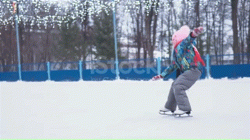
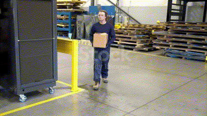
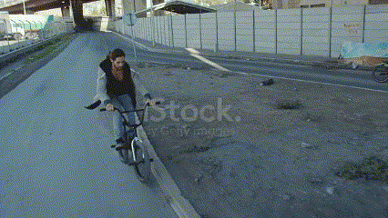

# Fall-Detection using YOLOv7

## Abstract:

This project focuses on developing an AI-based Fall Detection system using the YOLOv7 object detection model. The system aims to detect falls in real-time from video streams or recorded videos, leveraging deep learning techniques for accurate detection. By utilizing the YOLOv7 model and a custom dataset, the project demonstrates the effectiveness of AI in enhancing safety and security in various environments.

## Keywords:

Fall Detection, cv2, Object Detection, Deep Learning,Yolov7,torch,torchvision,numpy,Matplotlib.

## Introduction:

The Fall Detection project utilizes the YOLOv7 object detection model to identify and classify falls in video footage. Falls are a critical issue, especially among the elderly and in hazardous environments. This system offers a proactive approach to detecting falls, enabling timely responses and potentially saving lives. The project employs a dataset of fall and non-fall examples, ensuring the model's ability to generalize to various fall scenarios.

## Methodology:

The core of the project revolves around the YOLOv7 model, a state-of-the-art deep learning model for object detection. The model is trained on a custom dataset containing annotated fall images. During inference, the model processes video frames, detecting falls with high accuracy. The project utilizes the OpenCV library for video processing and visualization, ensuring seamless integration with the YOLOv7 model.

## Authors and Co-Authors:

| Registration Number | Student Name      |
| ------------------- | ----------------- |
| 23011102086         | Sai Pranav S R    |
| 23011102073         | Rohit K Manoj     |
| 23011102098         | Sree Sai Raghav C |
| 23011102067         | Pretham Kumar K   |
| 23011102101         | Srri Hari T R     |

---

# Results and Discussion:

The Fall Detection system demonstrates remarkable performance in accurately detecting falls in real-time. By leveraging the YOLOv7 model's speed and accuracy, the system can be deployed in various settings, including hospitals, nursing homes, and public spaces, to enhance safety measures. The project highlights the potential of AI-driven solutions in addressing critical safety concerns.

| Input Video Cliped                                  | Output Video Screenshot                                                                                                                    |
| --------------------------------------------------- | ------------------------------------------------------------------------------------------------------------------------------------------ |
|  |  |
|  |  |
|  |  |
|                                                     |                                                                                                                                            |

## Accuracy and Loss graph:

## Confusion Matrix:

## Conclusion:

In conclusion, the Fall Detection project showcases the efficacy of the YOLOv7 model in detecting falls with high accuracy. The system's real-time capabilities and robust performance make it a valuable tool for enhancing safety and security in diverse environments. Moving forward, the project paves the way for further advancements in AI-powered fall detection systems, contributing to the improvement of healthcare and safety standards.

# How to Run:

- Install required modules by running `pip install -r requirements.txt`
- Download the [`yolov7-w6-pose.pt`](https://github.com/WongKinYiu/yolov7/releases/download/v0.1/yolov7-w6-pose.pt) model for human pose tracking.
- Run the `main.py` file.
- Type in the path of the input video file, some sample input videos are provided in the `fall_dataset/videos` folder.

# Fall Detection Implementation with YOLOv8

[`YOLOv8 Fall Detection`](https://github.com/RohitKM25/human-fall-detection-yolov8) implemented with custom pre-trained fall detection model, ensures more accurate results and significantly quicker processing speeds.
